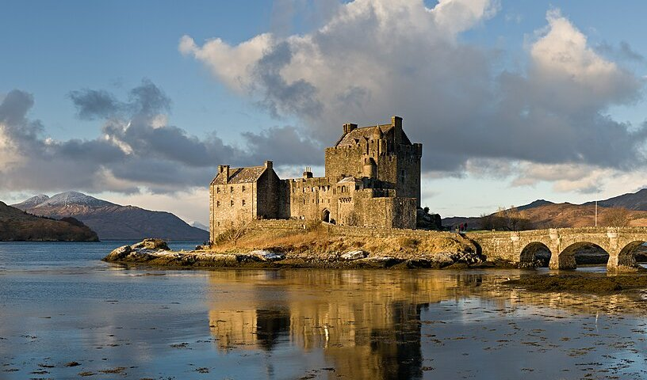
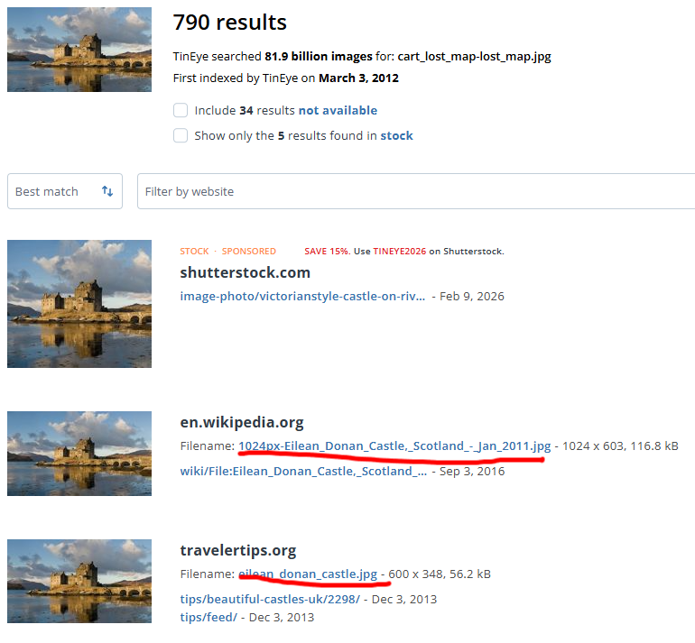

# CTF Write Up

## Challenge Info
**Name:** The Cartographer's Lost Map  
**Category:** OSINT  
**Event:** ISSessions 2026  
**Completed:** Yes  

## Challenge Description
A tattered map fragment was recovered from the ruins of the Arcane Library. The cartographer who drew it vanished years ago, but the map depicts a real-world fortress that fantasy legends were built upon.
The fortress sits where three great waters meet, on an isle in the highlands of the old world. Identify the castle and submit its name.
Flag.

## Challenge Files

---

## Investigation
The attack started with a reverse image search of the provided file.

After scrolling through matches, it became clear it was of the Eilean Donan Castle.
Sample link - https://en.wikipedia.org/wiki/File:Eilean_Donan_Castle%2C_Scotland_-_Jan_2011.jpg

## Outcome
**Flag:** FantasyCTF{eilean_donan_castle}
