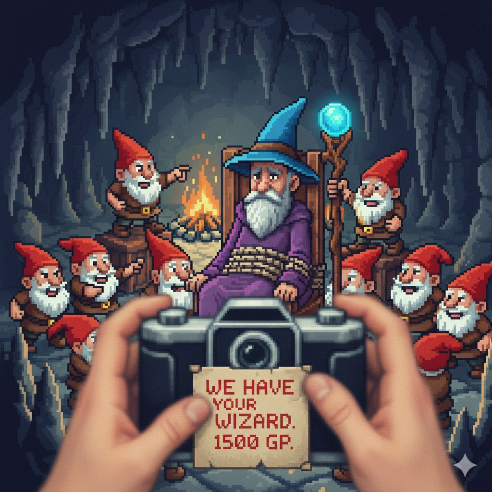

# CTF Write Up

## Challenge Info
**Name:** Rescue of the Wizard  
**Category:** OSINT  
**Event:** ISSessions 2026  
**Completed:** No

## Challenge Description
>hey,
>so, i may have casted a spell or two on some wrong people and i ended up getting kidnapped by a bunch of little gnomes (don't even ask how). i am being kept hostage, please rescue me. they are asking for a ransom of 1500 >GP, but im pretty sure you can figure another way out of this right? excuse my poor language, these evil creatures are forcing me to write this and it creates a lot of pressure.
>-april the wizard
>Flag format: FantasyCTF{one_word_location_where_the_wizard_is_held}

## Challenge Files

---

## Investigation
Open image file in HxD to view metadata
put an image here when you stop being lazy

Base64 code can be found at the end of the file
put an image here when you stop being lazy
When decrypted it says "use the search function in pastebin"

Additionally, there are mentions to Pickaxe_Pete in the Exif Data, I found it in the bytes because why do things the easy way.
put an image here when you stop being lazy

When searching for pickaxe pete in pastebin a set of messages can be found - https://pastebin.com/Peb52UPd

This leads us to the pastebin account Gnomey88 - https://pastebin.com/u/gnomey88

Now there are two posible next steps which is to investigate the numbers in the pastebin titles, or to look through the coords of the other pastebin, however I was unable to make sense of either.

---

## Outcome
Failed to solve
